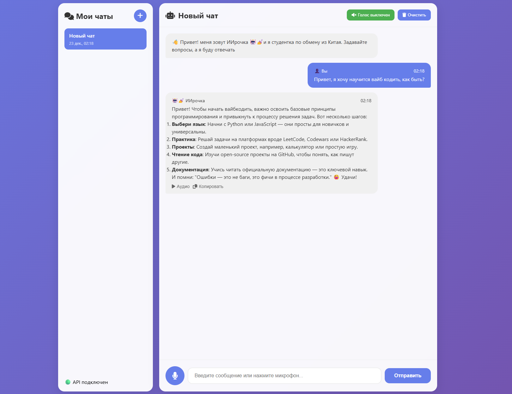

# AIrochka 🤖💅
<p align="center">
       
</p>

Знакомьтесь, это ИИрочка! Студентка по обмену из Китая, что ассистирует преподавателя по программированию. Иногда приходит на лекции в конце семестра. Выдавет только базу и никакого кринжа, вайбкодит                                          

Веб лицо ИИрочки:           
          

Спасибо deepseek'у за сгенеренную базу (как же нейронки научились генерить веб). Поправил не доделки вайб кода и работу кнопочек. 
Чтоб работало нужен какой-нибудь ИИ API ключ для ИИрочки        

- Проект за вечер на python с flask и немного js/html. Все в одном файле                        

## Зависимости

Нужен python3              

## Установка

Что-то из этого надо поставить:

```bash
sudo apt update
sudo apt install libasound-dev portaudio19-dev python3-dev
pip install requests flask pyaudio SpeechRecognition edge-tts playsound markdown
```

## Запуск

```bash
python3 AIrochka.py
```

Подключится можно по 5000 порт в браузере. При запуске браузер откроется
